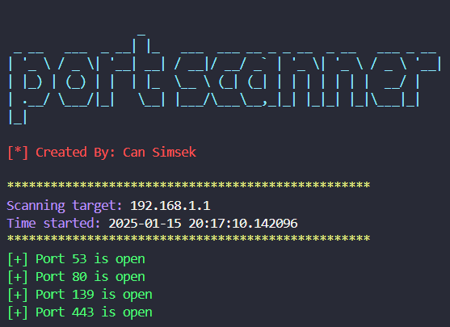
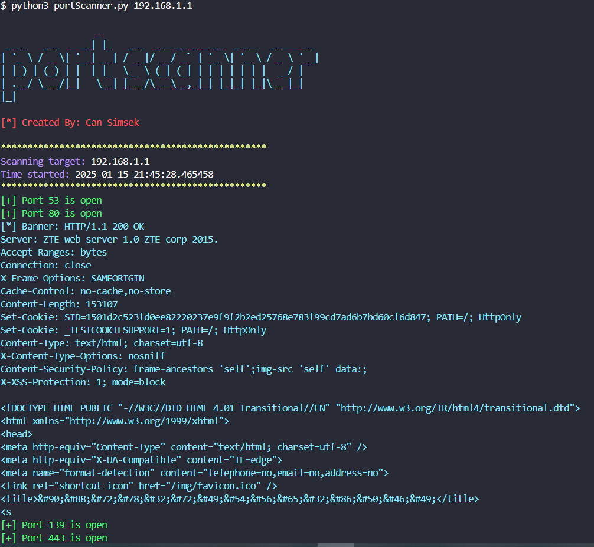

# Port Scanner

Port Scanner is a simple and efficient cybersecurity tool that scans the open ports on a given IP address. It uses multi-threading to perform fast scanning, performs banner grabbing for service identification, and provides a user-friendly output with color-coded results.

### Features

- Scans for open ports on a target IP address
- Performs banner grabbing to identify running services
- Supports specific port scanning
- Uses multi-threading for faster scanning
- Provides clear and color-coded output
- Easy to use with simple commands

### Installation

To run the Port Scanner, you need to have Python 3 and the required libraries installed. You can install by cloning the repository:

```
git clone "https://github.com/Muhammetcansimsek/port_scanner.git"
```

### Usage

There are multiple ways to use the Port Scanner:

1. Scan all ports (1-1000):

```bash
python3 portScanner.py <target_ip>
```

Replace <target_ip> with the IP address you want to scan.

```bash
python3 portScanner.py 192.168.1.1
```



2. Scan a specific port:

Examples:
```bash
# Scan all ports
python3 portScanner.py 192.168.1.1

# Scan specific port
python3 portScanner.py 192.168.1.1 -p 80
```

