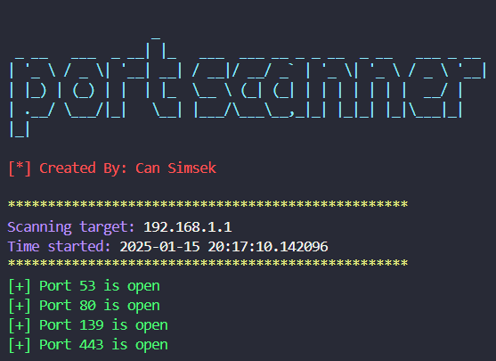

# Port Scanner

Port Scanner is a simple and efficient cybersecurity tool that scans the open ports on a given IP address. It uses multi-threading to perform fast scanning and provides a user-friendly output with color-coded results.

### Features

- Scans for open ports on a target IP address.
- Uses multi-threading for faster scanning.
- Provides clear and color-coded output.
- Easy to use with a single command.

### Installation

To run the Port Scanner, you need to have Python 3 and the required libraries installed. You can install the dependencies using the following command:

```
git clone "https://github.com/Muhammetcansimsek/port_scanner.git"
```

### Usage

To use the Port Scanner, simply run the following command:

```
python3 portScanner.py <target_ip>
```

Replace <target_ip> with the IP address you want to scan.

```
python3 portScanner.py 192.168.1.1
```

